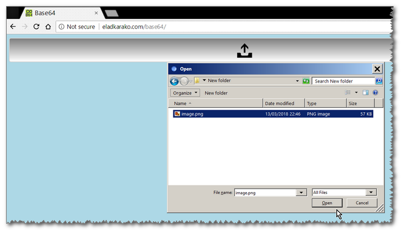

<h1> any2base64</h1>

<h2>A Good Example On How To Use HTML5's Background Running Web-Worker With Messaging And Async-FileReader.</h2>

<ul>
  <li>Supports All File-Types (exe, flash, js, mp3, mp4, webm,...)!</li>
  <li>Supports Unlimited File Sizes! Note that you might still want to keep it small though ..</li>
  <li>No Uploads! Everything Runs Locally In Your Browser: FASTER, PRIVATE, SECURE!</li>
  <li>Multiple Parallel File-Convert, Runs In A Background-Thread, Using HTML5-Workers!</li>
  <li>Base64 With Accurate-Mimetype, Which Identifies Over 640 Even If Your Computer Does Not Know It!</li>
</ul>

<ul>
  <li>Easily Embed The Base64-Text In Your Website Or Application Without The Need To Handle Actual Files.</li>
</ul>

Note that SVG files with Unicode/UTF-8 characters will be broken, this seems to be a bug in every browser implementation, so you probably won't be able to include such SVG file in an inline-image SRC or CSS as is, instead you would be required to use JavaScript and decode the base64 into binary string, following with converting it back to non-binary string using `decodeURIComponent(escape(str))`. This happend due to the rendering of characters in the SVG engine and not related to `charset` argument. Currently this issue happens in all browsers. Better use PNG/GIF (alternativly you may use HTML-ENTITY encoded HTML source instead...)

<h2>Visit Live Example: <a href="http://eladkarako.com/base64/">eladkarako.com/base64</a></h2>

 
 

