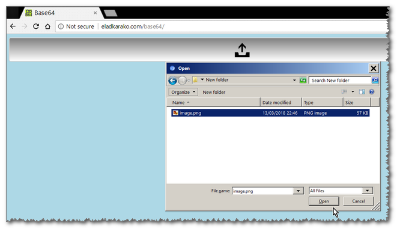

<h1>∞ ➩ ＢＡＳＥ６４</h1>

- 100% In Your Browser, Pure Client-Side. Nothing Is Uploaded Anywhere - Secure!
- Any File-Type.
- Any Amount Of Files.

For now:
no web-workers (1 thread)
so for now try to keep it under 1MB to avoid browser stop-responding. 

